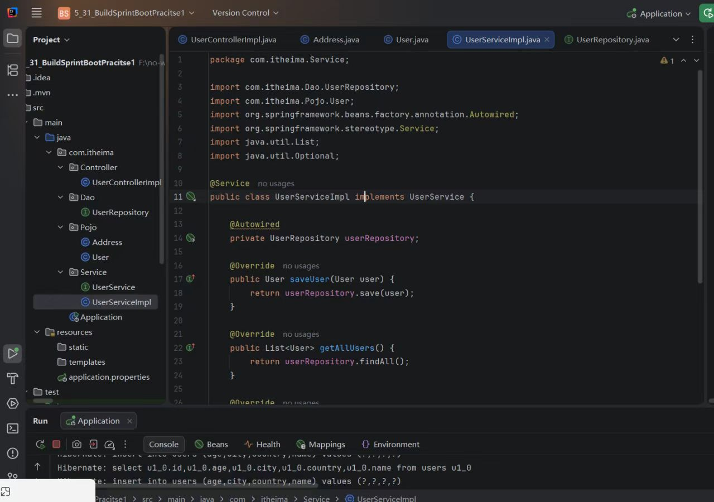
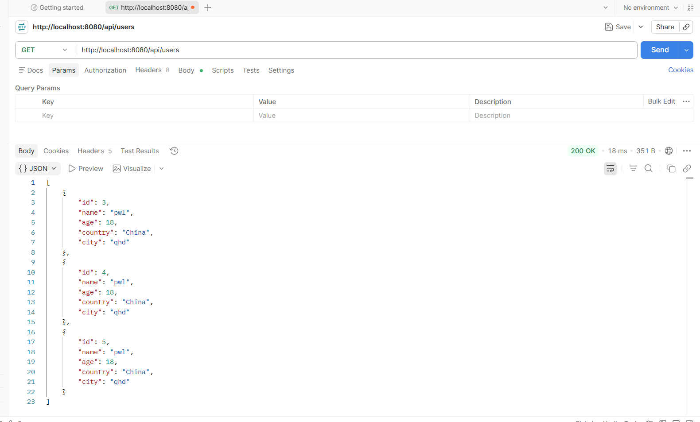
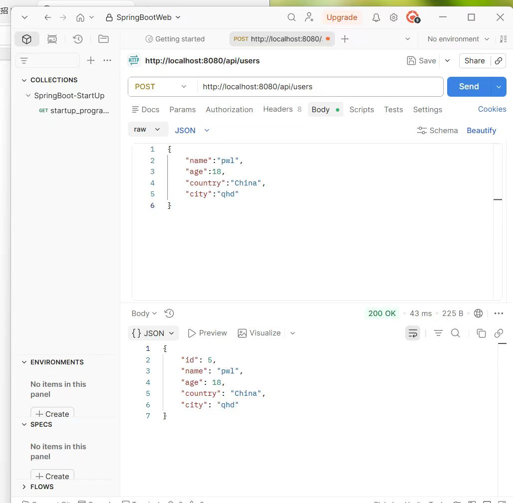

# Week5
---
1. [学习内容](#学习内容)
2. [思考](#问题改进思考)
3. [作业](#作业)
## 学习内容
---
1. javaweb
    1. springboot
    2. http，web请求
    3. 三层结构
2. 刷了代码随想录中数组的题目
3. 了解了一下速通的前后端+开发流程；

## 问题&改进&思考
---
1. 自己学习某一个内容中没有总体的感知，没有体系，没有知道-》~~自己觉得可以再week0中加入前后端速成内容学习or总体的开发流程之类的~~，这样可以有一个总体的框架，这样学具体内容的时候就是做到心里有数，实现的功能；自己也有看了一些之类的；

>工程思维
2. 这周学的时候旧视频中版本老，挺多不同的，自己看了新的，但是新的没有postman那一块的，又回来补充了
3. 自己跳过了细节，所有这周是目前看的最快的一次，但是就是有一种自己掌握的不是很好的想法  
4. 就是6.8号的我回头来看自己前几周学的其实不好（因为自己独立敲不出来，就是当我去写作业的时候自己脑袋空空，1. 没有总体认识就是它在整个过程中的作用2.没有主动去想or去学）（其实现在我还是觉得自己得补救一下or之后就是多多锻炼一下）
**疑惑**  
   1. 对于我来说多用就会掌握，但是这些学的我去哪里练习应用呢？
   2. 如何评估自己学习的掌握程度，我没有一个标准来评估自己的学习效果？因为我看周报欢哥是自己能够独立敲出来？那自己就是掌握的不太好？我该去哪里练习呢？就是经过我的复盘我发现我学的很多都忘记了，也独立敲不出来；
   3. 自己实践理解总体理解的非常不好；
## 作业
---
当时是用ai的，就是大体弄懂了，当时自己敲不出来（之后再打算补交一下这个作业文档）

